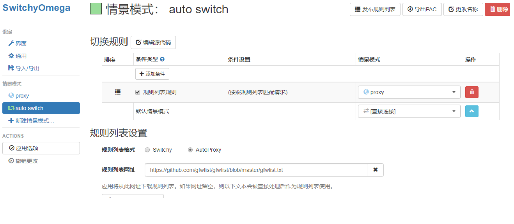
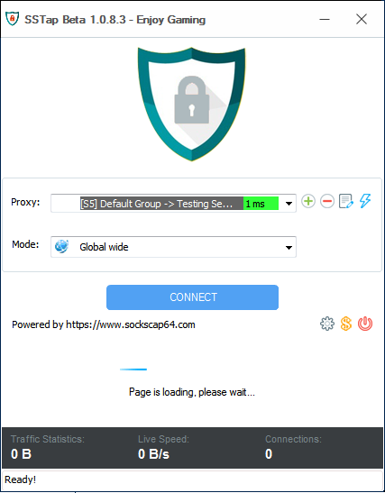

# SSR 配置教程

## 1. 下载并使用客户端
- 提供[Windows](https://github.com/mioSSR/SSR-Backup/releases/download/untagged-2aebb6f09ad5a7786faf/ShadowsocksR-4.6.1-win.7z)/[Android](https://github.com/mioSSR/SSR-Backup/releases/download/untagged-2aebb6f09ad5a7786faf/ShadowsocksR-3.4.0.5-android.apk) 下载  
- WIN把压缩包里面的**所有文件**解压到一个文件夹中。**Win版本根据电脑.net版本选择2.\*/4.\***
- 打开程序之后第一步先找到 SSR 的任务栏图标（纸飞机样子的图标），双击打开,删除原有服务器订阅(作者停止维护,已失效).添加完服务器后,*右键小飞机切换到自己的服务器(***重要!!!**).
- Android打开后一样,点击ShadowSocks右下角出现操作提示.
- IOS AppleStore 好像有(不确定)

## 2. 功能说明(右键小飞机更改设置)
- 直连模式
  1. 此模式下http不走SSR代理,请采用Socks5代理方式连接,默认端口1080(Telegram/浏览器代理 等配置代理为127.0.0.1:1080).
  2. Chrome/Firefox + SwitchyOmega +直连模式超级好用. 规则列表采用*https://github.com/gfwlist/gfwlist/blob/master/gfwlist.txt*   
  
- PAC模式
  使用PAC文件控制代理。PAC文件包含了规则列表，控制流量走SSR或者不走SSR(配置文件*SSR目录下pac.txt*),可以自行修改.
- 全局模式
  代理全部HTTP流量.游戏或者应用
- 选项设置
  可能用到的大概就是开启启动了.其他的没特殊要求基本不用也最好不要用.
- 二维码扫描
  通过扫描屏幕二维码添加服务器(*记得修改到添加的服务器*)
- 剪切板导入
 从剪切板导入.先复制ssr://!~~~链接到剪切板

## 3. 游戏请使用 SSTap
  
[下载链接]  (https://www.sockscap64.com/zh-hans/sstap/)  
游戏代理规则可参考[https://github.com/FQrabbit/SSTap-Rule]  
替换SStap目录下的rule文件夹即可.

## 3. 其他可能需要的操作
- 刷新dns : cmd运行 ```ipconfig /flushdns```
- 更改端口: 右键在选项设置中找
- ps: 请先确认连上代理